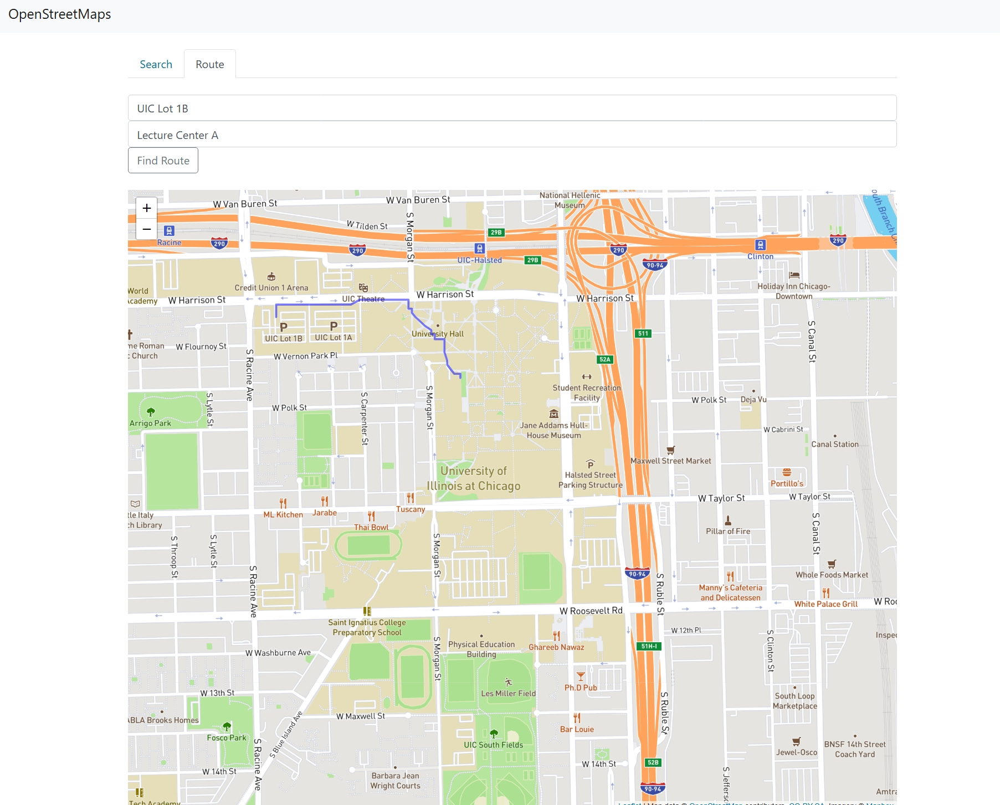

# UIC OpenStreetMap

This project allows users to find the shortest paths on a map represented as a graph. It involves implementing a graph data structure, parsing real-world map data (from OpenStreetMap via JSON), and applying Dijkstra's algorithm for pathfinding, specifically tailored for the UIC campus map.
## Features

- **Graph Implementation:** Custom C++ graph class `graph.h` using an adjacency list. Supports directed, weighted edges and self-loops.
- **JSON Data Parsing:** Reads pre-processed OpenStreetMap data (buildings, waypoints, footways) from JSON files using a C++ JSON library.
- **Graph Construction:** Builds the map graph, representing footways as undirected edges and connecting buildings to nearby path nodes.
- **Dijkstra's Shortest Path:** Implements Dijkstra's algorithm to find the shortest path, excluding intermediate buildings. Uses C++ `priority_queue`.
- **Text Interface:** A command-line application `main.cpp` to find and display paths between buildings.
- **Web Interface:** A local web server `server.cpp` using `httplib.h` to visualize shortest paths graphically.

## Technologies Used

- **Make:** Build automation tool.
- **Third-party C++ JSON Library:** User's choice of a header-only library for parsing map data.
- **httplib.h:** C++ header-only library for the web server interface.
- **OpenStreetMap Data:** Base map data, pre-processed into JSON.

### Installation/Build

1.  **Clone/Download:** Git clone.
2.  **Add JSON Library:** Place the chosen C++ JSON library header file(s) in the project's root directory.
3.  **Build Executables using Make:**
    * Build tests:
        ```bash
        make osm_tests
        ```
    * Build text interface:
        ```bash
        make osm_main
        ```
    * Build web server:
        ```bash
        make osm_server
        ```
Once you are done, you can run `make run_server` to run a C++ web server that will display the graphical output of the shortest path between two buildings, using our downloaded OpenStreetMaps data.

### Running Tests

```bash
make test_all       # Run all tests
make test_graph     # Run only graph implementation tests
make test_build_graph # Run only graph building tests
make test_dijkstra  # Run only Dijkstra algorithm tests
```

### Acknowledgement

This project belongs to my data structure class. It is strictly for educational purposes.
